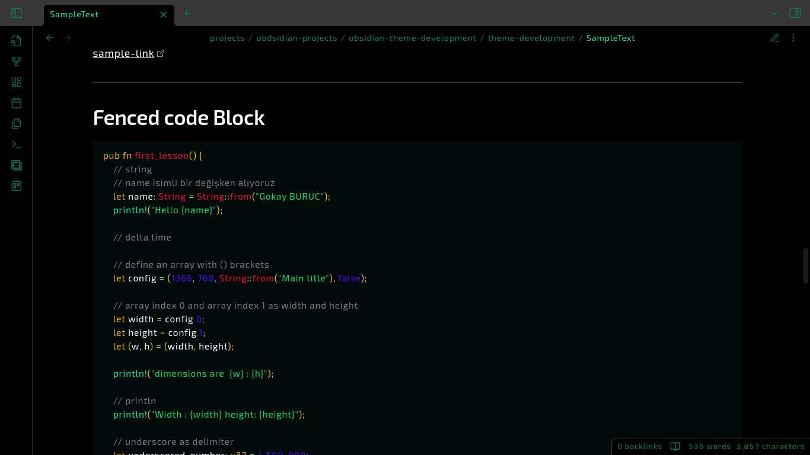
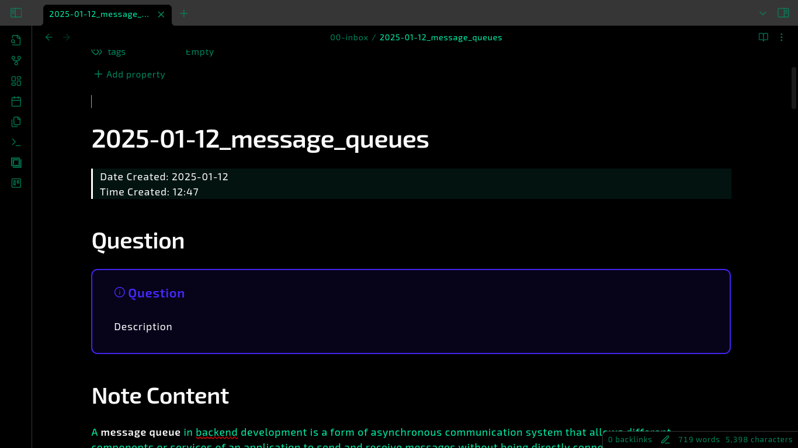
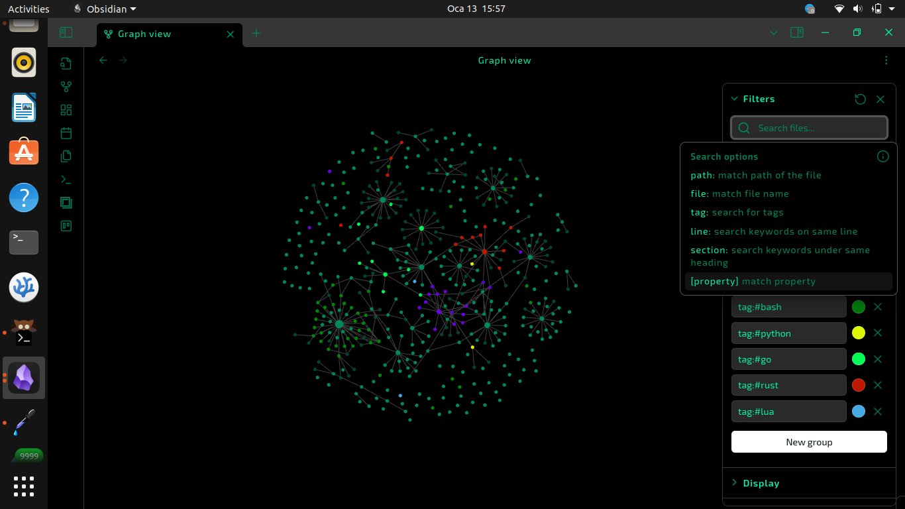
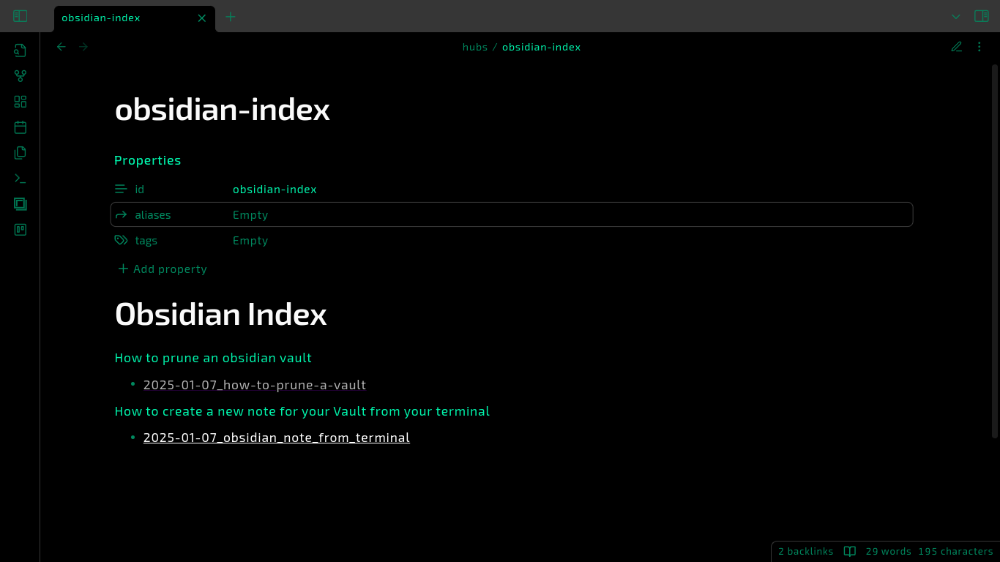
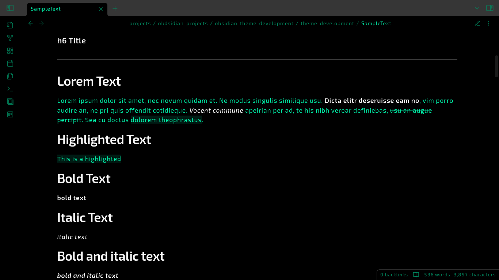
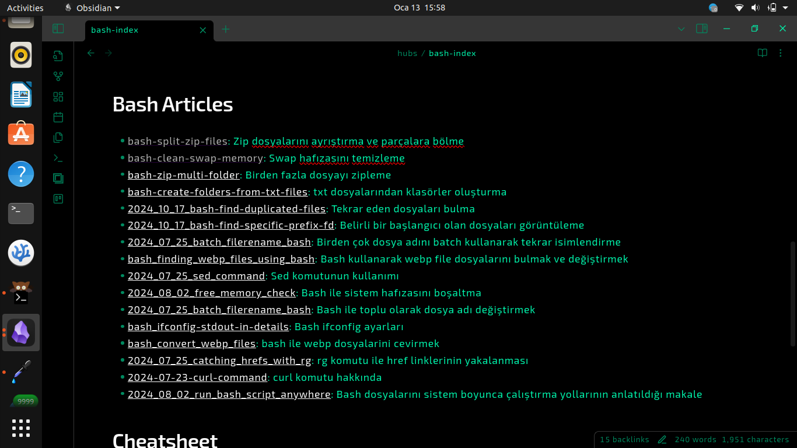

# CyberDev Obsidian Theme

## Introduction

This theme is built for night-coders and developers.All hail to night owls!

## Prerequisites

You can take a glance at these resources before starting to build a new Obsidian Theme.

1. [Build a Theme for Obsidian - Official Docs](https://docs.obsidian.md/Themes/App+themes/Build+a+theme) : Explains how to create a new theme from a GitHub Obsidian theme template
2. [Obsidian CSS Variables - Official Docs](https://docs.obsidian.md/Reference/CSS+variables/Components/Button) : Obsidian CSS variables by default

## Screenshots

### Desktop Screenshots

Code Block:


Callouts:


Graph:


Properties


Lists


Text Formatting (bold,italic)


External Links


### Android Screenshots

> PS: It will be added soon.

## Usage

`cd` into your vault path :

```bash
# cd <vault-path>
cd $HOME/Documents/vaults/my-vault
# WARN: use your own vault path


```

Clone this repository into `.obsidian/themes` path of your **vault**

```bash
cd .obsidian/themes
git clone https://github.com/gokayburuc/cyberdev-obsidian-theme.git
```

Then rename the folder from `cyberdev-obsidian-theme` into `cyberdev`

Open your Obsidian Vault and find the theme using `Open Settings>Apperance`. Select the theme. That's all.
