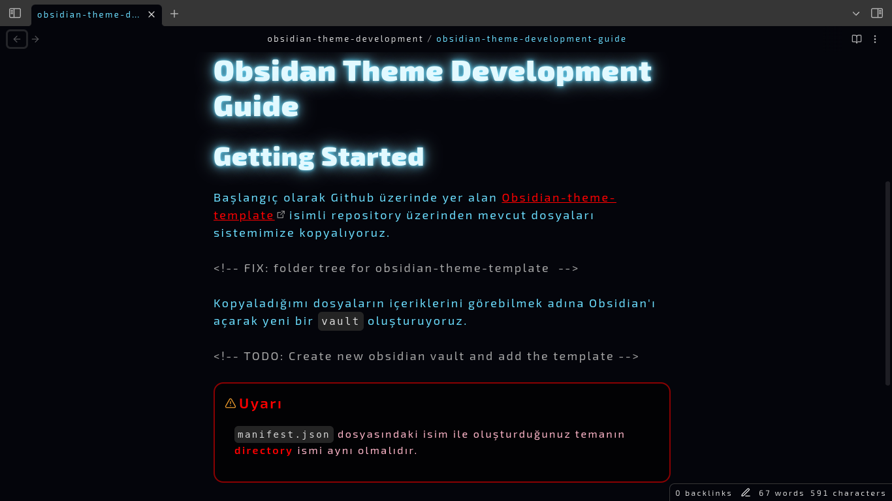
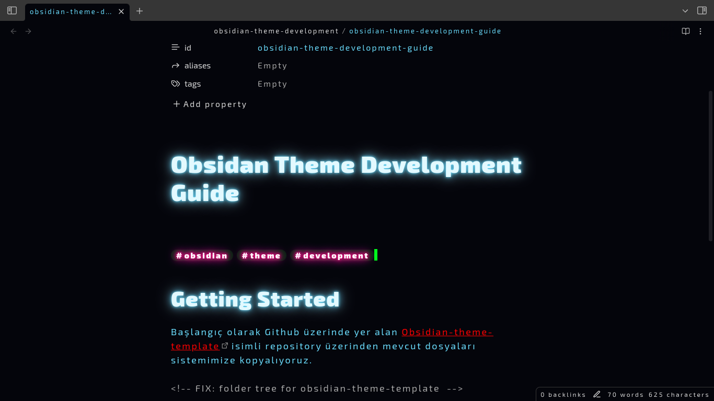

## Cyberdev Obsidian Theme

### Introduction

The Obsidian Theme project I am developing is published as open source under the MIT License. This means that you can make any changes you want on the theme project with `fork` and `clone`.

### Screenshots

### Basic Features

- Neon Glow Headers
- Neon Glow Tags
- Color Selection for Night coders
- Amoled Background

### Usage

Just clone this repository into your vault's `.obsidian/theme/` path. Then open your **Obsidian** and go to `Settings/Appereance` settings. Find the theme `cyberdev` here in installed fonts.
